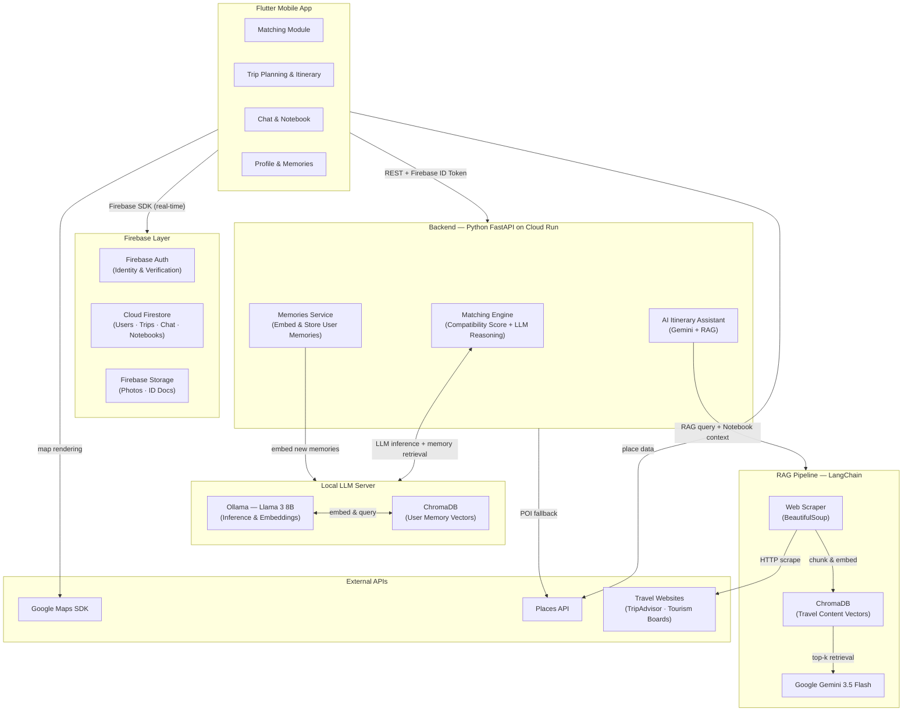

<div align="center">

# 🪹 TripNest
### by See u in MMU

**Team:** Yeat Jing Rong · Toh Shee Thong · Kimberly Chan · Tan Qian Wen  
**Problem Statement:** Travel Planner

[🎥 Video Presentation](Unlisted_Youtube_Link) · [📑 Presentation Slides](Public_Link)

<br>

> *“You can find a destination in seconds.*  
> *But **finding someone** who shares your budget, your pace, your interests, and your idea of fun?*  
> ***That’s the real journey.***”

<br>

**Different people. Different dreams. One journey — why compromise?**

</div>

---

## 1. Project Overview

### The Problem

Every year, people travel alone when they didn't want to — or travel with people who turn the trip into a compromise.

The problem isn't finding a destination. **It's finding the right people, aligning everyone's needs, and turning them into a trip that actually works.**

**Three major gaps stand out:**

### ① Finding the right travel companion is still a trust problem

People rely on Reddit, Facebook Groups, and WhatsApp to find travel buddies. But these platforms offer little identity verification or compatibility screening.

Budget, travel pace, interests, and daily routines can easily clash, yet these factors are rarely considered before people connect. Existing platforms focus on social discovery, not deep compatibility matching.

**Finding a travel companion is easy. Finding the right one is not.**

### ② Group travel planning is scattered

A typical trip uses WhatsApp for discussion, Google Maps for places, a document for ideas, an itinerary app for planning, and a spreadsheet for expenses.

These tools don't share the same context. A decision made in chat doesn't update the itinerary. A useful place gets buried in messages. Plans become outdated, conversations get repeated, and conflicts appear at the last minute.

**Planning becomes a coordination problem instead of an enjoyable part of the trip.**

### ③ AI can plan a destination, but not your group

AI can generate a 7-day Tokyo itinerary in seconds.

But it doesn't automatically know that one person hates early mornings, another has a RM250/night budget, and someone else can't walk more than 12,000 steps. The itinerary may look perfect on paper, **but not for the people taking the trip.**

So everyone edits it until the original AI plan is almost gone.

**The missing piece isn't better itinerary generation. It's understanding the people behind the trip.**

---

**Stakeholders:**

| Stakeholder | Pain Point |
|---|---|
| **Solo travellers (18–35)** | Can't find a trusted, compatible companion; end up going alone or not at all |
| **Small friend groups (2–4 pax)** | Planning chaos across too many tools; no single source of truth |
| **Couples travelling together** | Misaligned expectations on pace/budget surface too late, during the trip |
| **Digital nomads** | Repeatedly need new companions in new cities; no platform remembers their travel DNA |

---

**Why existing apps fall short:**

| App | What it does | The gap |
|---|---|---|
| **Wanderlog** | Collaborative itinerary builder | No companion matching, no group chat, no AI that reads *your* group's preferences |
| **Tourlina / Travello** | Travel social network & buddy search | Interest-based only, no compatibility scoring, no ID verification, no planning workspace |
| **TripIt** | Auto-organiser from confirmation emails | Purely personal, no social layer, no planning, no matching |
| **Google Travel** | Flight & hotel discovery | Inspiration tool only — no planning workspace or collaborative features |
| **ChatGPT / Gemini** | AI itinerary generation | Generic output — has no idea who you're travelling with or what you've already decided |

**The gap is total.** Not one of these connects safe companion discovery → compatibility-screened matching → preference-aware AI planning → group coordination → social sharing in a single, coherent product.

---

### Our Solution

**TripNest is the first app that closes the loop between finding a compatible travel companion and planning a trip together.**

Users swipe through a 5-topic travel-DNA quiz on first launch. They find a verified, compatibility-scored match. They plan inside a shared trip workspace where an AI reads their group chat's saved decisions and proactively optimises their itinerary — no generic suggestions, only ones grounded in what the group actually agreed on.

**The Complete Feature Set:**

| # | Feature | What it does |
|---|---|---|
| 1 | 🎯 **Travel DNA Onboarding** | Swipe left/right across 5 lifestyle topics to build a preference vector in under 2 minutes |
| 2 | 🪪 **TravelID Badge** | A passport-style shareable profile card showing travel style, MBTI, verification status, and compatibility score at a glance |
| 3 | 🔐 **ID Verification Gate** | Hard identity check before any match request can be sent — a safety-first design decision |
| 4 | 🤝 **Compatibility-Scored Matching** | Match list ranked by % compatibility across pace, budget, interests, MBTI, destination, and dates |
| 5 | 🗓️ **Trip Folder Workspace** | Trip folders with status tracking (Upcoming / Ongoing / Completed), list and calendar views |
| 6 | 🗺️ **Interactive Itinerary Map** | Day stops rendered on a live Google Maps view with walking estimates and transit methods |
| 7 | ✨ **Context-Aware AI Assistant** | Reads your group's Notebook and suggests itinerary changes grounded in your actual decisions |
| 8 | 📔 **Memories** | A shared space to save and look back on the best photos and moments from your trip together. |
| 9 | 📓 **Shared Trip Notebook** | Drag any chat message into the Notebook; AI reads these to personalise the itinerary |
| 10 | ☑️ **Planning Check Cards** | Visual checklist generated from Notebook entries so nothing decided in chat is forgotten |
| 11 | 📰 **Social Travel Journal** | Post trip entries with public or friends-only visibility; a feed of real travel stories |
| 12 | 🎮 **TripCoins Gamification** | Earn coins for journaling, completing trips, and community engagement — drives retention |
| 13 | ⭐ **Reliability Score** | A trust metric per user built from past trip completion rate and response behaviour |

---

## 2. Ideation & Process 
### From a Broad Travel Platform to One Core Problem

Our initial concept was a general AI travel assistant covering the entire travel journey, from destination discovery and social-media inspiration to itinerary planning, preparation and expense splitting.

However, during mentor consultation, we realised that **solving many travel problems at once made our solution too general**. The question became:

> **What is the one problem TripNest should solve exceptionally well?**

We compared the problems travellers face before, during and after a trip and identified one particularly underserved problem:

### Finding the right person to travel with, and successfully planning the trip together.

For solo travellers, the problem begins before itinerary planning.

They may:

- Want to travel but have no travel companion.
- Search for strangers through Reddit, Facebook Groups or social media.
- Have safety concerns when meeting strangers online.

This led us to narrow TripNest's core problem to:

> **How might we help travellers find a compatible and trustworthy travel companion, then turn that match into a workable trip without switching between multiple apps?**
>

### 2.1 Ideas We Considered

Through team discussion and mentor feedback, we narrowed our solution around one core problem: **helping travellers find a compatible and trustworthy travel companion, then plan the trip together.**
| **Idea** | **Status** | **Reasoning** |
|---|---|---|
| **General AI Travel Chatbox** | 🔄 Refined | Originally intended to solve the entire travel-planning process. We kept it as an entry point, but reduced its role so it supports the core companion-to-trip journey rather than becoming the product itself. |
| **Social Media Travel Inspiration** | ❌ Dropped | not directly solve our core problem of finding a compatible and trustworthy travel companion. |
| **Destination / Travel Recommendation** | ❌ Deprioritised | “Where should I travel?” is already addressed by many travel platforms and is too broad to differentiate TripNest. |
| **Swipe-based Travel DNA Quiz** | ✅ Chosen | Creates a structured preference profile quickly and makes compatibility measurable instead of relying on vague profile descriptions. |
| **Compatibility Scoring** | ✅ Chosen | Gives travellers an immediate way to understand whether another person is likely to be a suitable travel partner. |
| **ID Verification** | ✅ Chosen | A major barrier to meeting strangers is trust. Verification directly addresses the safety concern behind companion matching. |
| **TravelID Profile** | ✅ Chosen | Makes a traveller's identity, travel style and verification status easy to understand before connecting. |
| **Solo Traveller Matching** | ✅ Core | This became the primary problem we wanted to solve: helping travellers find someone compatible to travel with. |
| **Group Chat** | ✅ Core Support | Matching alone is not enough. Once travellers connect, they need a place to communicate and make decisions without leaving TripNest. |
| **Group Preference & Harmony** | ✅ Core Support | Different travellers may have conflicting budgets, walking tolerance, pace and interests. The system helps turn these differences into practical compromises. |
| **Shared Trip Notebook** | ✅ Chosen | Decisions made in conversation can easily be forgotten. The Notebook connects discussion with actual trip planning. |
| **AI Itinerary Assistant** | ✅ Chosen | Instead of generating another generic itinerary, the AI uses the group's actual decisions to produce more relevant suggestions. |
| **Interactive Itinerary Map** | ✅ Chosen | Converts group decisions into a practical route that the travellers can review together. |
| **Three AI Plan Versions** | 🔄 Simplified | Budget / Balanced / Comfort demonstrates how AI can resolve different spending expectations, but it is secondary to the core matching problem. |
| **Trip Preparation** | 🔄 Supporting | Useful after the trip has been agreed upon, but not part of the core problem. |
| **AI Receipt / Expense Splitting** | ❌ Dropped | Not directly support our core problem of finding a compatible travel companion. |
| **Social Travel Journal** | ❌ Deprioritised | Useful for retention and memories, but unrelated to the primary problem we identified. |
| **TripCoins Gamification** | ❌ Deprioritised | Adds engagement but does not directly solve the problem. |
| **Live Flight & Hotel Booking** | ❌ Dropped | Requires complex booking infrastructure and payment integration. We only provide recommendations and price comparison. |
| **AR Destination Preview** | ❌ Dropped | High implementation complexity with limited connection to our core problem. |
| **In-app Video Calls** | ❌ Dropped | Existing platforms such as WhatsApp and FaceTime already solve this problem effectively. |
| **Local Guide Marketplace** | ❌ Dropped | Introduces a separate supply-side marketplace problem outside TripNest's core purpose. |
| **Real-time Collaborative Editing** | ❌ Dropped | Technically complex and unnecessary when group chat, Notebook and AI suggestions can support asynchronous collaboration. |
---

### 2.2 Ideation Boards

#### Problem Tree — Identifying the Core Problem


This problem tree maps the causes and effects of travelling without a suitable companion. We identified **lack of structured compatibility information** and **lack of trust when meeting strangers** as two major root causes, which led us to focus TripNest on safe and compatible traveller matching.

---

#### Idea Iteration — From General Travel Assistant to TripNest


Our idea evolved through several stages. We first explored a general AI travel assistant, then moved towards companion finding, and finally connected **matching → group discussion → preference alignment → itinerary planning**. This helped us narrow the product instead of continuously adding unrelated travel features.

---

#### Feature Mindmap — Exploring the Solution Space


The mindmap captures the different features we considered during brainstorming. We used it to separate **core features that directly solve our selected problem** from supporting features and ideas that could be removed without affecting the main solution.

---

#### User Flow — From Finding a Companion to Planning a Trip


The user flow shows the main TripNest journey:

**Verify → Match → Connect → Align → Plan**

It demonstrates how the different core features work together rather than functioning as separate travel tools.

---

### 2.3 Mentor Consultation

**Date: 7 Sep 2026** <br>
**Mentor: Daniel Koh Yu Hang** <br>

| **Feedback Received** | **What Was Changed** |
|---|---|
| **The app currently has too many functions and tries to solve too many travel problems.** | We narrowed our focus from a general travel platform to the specific problem of **finding a compatible and trustworthy travel companion and planning the trip together**. |
| **The problem should be specific rather than simply “making travel more convenient”.** | We defined specific pain points: lack of compatibility information, safety concerns when meeting strangers, preference conflicts and fragmented planning after matching. |
| **Think about what happens if a solo traveller does not have a group.** | We made **Solo Traveller Matching** the core feature, supported by Travel DNA, ID verification and compatibility scoring. |
| **After matching, users should be able to communicate with each other.** | We added a dedicated **Group Chat** inside the Trip Folder so matched travellers can discuss their trip without immediately moving to another platform. |
| **AI can detect useful places from social-media links.** | We kept **Social Inspiration** as a supporting feature. AI extracts places and useful information from shared travel content and adds them to the trip. |
| **Group preferences should be used as a reference when planning.** | We introduced **Group Preference & Harmony**, allowing TripNest to identify differences in budget, pace, walking tolerance and interests before generating the itinerary. |
| **The app does not need to become a booking system.** | We changed flight, hotel and transport functionality from direct booking to **recommendation and price comparison**. Users can make the final booking through the original provider. |
| **Focus on solving one problem well instead of adding more functions.** | We moved features such as gamification, journaling, AR, video calls and the guide marketplace away from the core prototype. |

### Final Direction

The mentor consultation helped us change our thinking from:

> **"How can we build an app that helps people travel?"**

to:

> **"How can we help someone who wants a travel companion find the right person, trust them, and successfully plan a trip together?"**

This became the core direction of **TripNest**:

**Find → Verify → Match → Connect → Align → Plan**

---

## 3. Design & Prototype

**UI Prototype:** `[ TODO — Insert your Figma / Canva / Netlify link here. Verify it opens in incognito. ]`

The app follows a cohesive design language: **Midnight Navy** (`#0F172A`) as the primary tone, **Azure Blue** (`#2563EB`) as the action accent, **Ice Blue** (`#EBF4FB`) as the background tint, and **Plus Jakarta Sans** as the type system throughout. 

**Key screens covering the end-to-end flow:**

| Screen | Interaction it demonstrates |
|---|---|
| **Splash + Auth** | Branded entry point; Google Sign-In → auth gate |
| **Travel DNA Onboarding Quiz** | Swipe left/right between two illustrated lifestyle options across 5 topics |
| **Home Feed** | Personalised discovery cards (flights, hotels, experiences) + current active trip banner |
| **Find Buddy — Set Preferences** | Filter by destination, dates, budget, pace, interests, MBTI |
| **Find Buddy — Match List** | Compatibility-scored cards with TravelID badge preview on tap |
| **ID Verification Modal** | Photo-upload prompt with verification status indicator |
| **Trip Workspace — Day Timeline** | Day-by-day stop list with time, category icon, walking estimate, travel method |
| **Interactive Itinerary Map** | Google Maps embed with day pins; expand to full-screen; tap pin for place detail |
| **Group Chat + Notebook** | Categorised messages with category badge chips; drag-to-save; Notebook panel below |
| **AI Assistant Panel** | Contextual suggestion cards with one-tap "Apply" and reasoning shown |
| **Social Feed** | Journal cards with public/friends-only badge; write journal FAB |
| **Profile Page** | TravelID badge, travel style tags, Reliability Score, Boarding Pass ticket view |

---

## 4. What Makes It Different

### The Central Insight

Every existing travel app treats **finding a companion** and **planning a trip** as separate problems. TripNest treats them as one continuous loop. That's not an incremental feature addition, it's a fundamentally different product architecture.

---

### Novel Features & Differentiators

| Feature | What's novel | Why it matters |
|---|---|---|
| **Notebook-aware AI Itinerary** | The only travel AI that reads your group's actual decisions before suggesting changes. If your chat Notebook says "no early mornings" and "hotel budget ≤ RM250/night", the AI suggests a 10:30 AM Day 2 start and stays within budget — without you re-entering preferences anywhere. | Eliminates the #1 failure mode of AI travel planners: generic output that ignores group context |
| **Travel DNA Swipe Onboarding** | 5-topic binary swipe quiz (pace, budget, rhythm, vibe, planning style) builds a rich compatibility vector before the user sees a single match. | First-match relevance is instant — not after 10 failed connections |
| **ID Verification Gate** | Cannot send or receive match requests without verified identity. Not a badge, not an optional tick — a hard gate. | The only travel-buddy platform with a structural safety guarantee, not just a policy |
| **TravelID Badge** | A shareable, passport-inspired profile card surfacing travel style, MBTI, verification status, and compatibility score in one glance. | Replaces the wall-of-text profile that nobody reads with a single scannable artefact |
| **Drag-to-Notebook from Chat** | In-chat messages tagged by category can be dragged directly into the shared trip Notebook. The AI reads the Notebook — not a separate form. | Closes the WhatsApp-to-itinerary gap with zero extra effort from users |
| **Reliability Score** | A second trust metric (separate from Compatibility %) built from past trip completion, response rate, and journal engagement. | Screens matches for dependability, not just compatibility |
| **TripCoins tied to travel actions** | Coins earned specifically for journaling, completing trips, and helping other travellers — not generic platform engagement. | Retention loop that improves the social feed as a side effect |

### Comparison Table

| Capability | TripNest | Wanderlog | Tourlina | ChatGPT |
|---|---|---|---|---|
| Companion matching | ✅ Scored | ❌ | ✅ Basic | ❌ |
| ID verification | ✅ Hard gate | ❌ | ❌ | ❌ |
| Travel style compatibility | ✅ 5-axis score | ❌ | ❌ | ❌ |
| Trip planning workspace | ✅ | ✅ | ❌ | ❌ |
| Group chat | ✅ | ❌ | ❌ | ❌ |
| Chat → Notebook → Itinerary loop | ✅ | ❌ | ❌ | ❌ |
| Context-aware AI (reads decisions) | ✅ | ❌ | ❌ | ❌ |
| Social travel journal | ✅ | ❌ | ✅ Basic | ❌ |
| Gamification / retention loop | ✅ TripCoins | ❌ | ❌ | ❌ |

---

## 5. Technical Architecture & Feasibility

### Tech Stack

#### Frontend

| Technology | Why chosen | Constraints & mitigations |
|---|---|---|
| **Flutter (Dart)** | Single codebase for both iOS and Android; rich animation and gesture APIs; fast UI iteration cycle; already has a working prototype | Dart ecosystem is narrower than React Native — mitigated by Flutter's comprehensive pub.dev package library and our team's existing familiarity |
| **State Management: Riverpod** | Reactive, compile-safe state management that scales from prototype to production; handles async streams from Firestore and the backend cleanly | Minor learning curve; well-documented with strong community support |
| **Google Fonts (`plus_jakarta_sans`)** | Runtime loading via `google_fonts` package; no asset bundling required | Requires internet on first launch; fonts are cached after first run |

---

#### Backend

> **Note:** The current prototype is frontend-only. The backend described here is the production architecture we plan to build during the building phase.

| Technology | Why chosen | Constraints & mitigations |
|---|---|---|
| **Python FastAPI** | Python is the natural choice given the heavy ML workload (Ollama, LangChain, embeddings). FastAPI is async, fast, and auto-generates API docs — useful for our team to coordinate frontend and backend work | Requires containerisation (Docker) to deploy consistently — mitigated by Cloud Run's container-native model |
| **Cloud Run (Google Cloud)** | Serverless container hosting — scales to zero when idle (no cost), scales up automatically under load. Natively verifies Firebase Auth tokens per request | Cold start latency (~1–2 s after idle) — mitigated by keeping a minimum one instance warm during the demo |
| **Firebase Auth (server-side token verification)** | Flutter sends the Firebase ID token with every API call; FastAPI verifies it using the Firebase Admin SDK — no separate auth stack needed on the backend | Straightforward to set up; Firebase Admin SDK is well-maintained in Python |

---

#### Database & Storage

| Technology | Why chosen | Constraints & mitigations |
|---|---|---|
| **Cloud Firestore** | Real-time listeners suit the group chat; offline persistence works on mobile out-of-the-box; flexible NoSQL schema suits evolving trip and profile models | Per-read/write pricing at scale — mitigated by Firestore caching, batched writes, and security rules that prevent over-fetching |
| **Firebase Storage** | Profile photos, ID verification uploads, and journal images stored as authenticated blobs tightly coupled to Firebase Auth | Free tier: 5 GB storage / 1 GB download per day — more than sufficient for the hackathon demo |
| **ChromaDB (Vector Store)** | Open-source, lightweight, runs embedded within the FastAPI service — used for two distinct purposes: *(1)* storing User Memory embeddings for the matching engine, *(2)* caching chunked travel web content for the RAG pipeline | Persistence requires a mounted volume on Cloud Run — mitigated by using Cloud Storage as ChromaDB's persistent backend |

---

#### AI & Machine Learning

| Technology | Role | Why chosen | Constraints & mitigations |
|---|---|---|---|
| **Ollama + Llama 3 8B (Local LLM)** | Matching engine reasoning & Memories embedding | Self-hosted open-source LLM — no per-token API cost; user Memory data stays on our own infrastructure (privacy-first). Llama 3 8B is strong at instruction-following and produces high-quality embeddings | Requires 8 GB+ VRAM for comfortable inference; for the hackathon demo, run on a team laptop or Google Colab with GPU |
| **User Memories Feature** | Personal travel context store | Users write freeform memories — past travel experiences, preferences, dislikes (*"I hate crowded tourist attractions"*, *"I always need a rest day after a long flight"*). Each memory is embedded via Ollama and stored in ChromaDB under the user's ID. At match time, the local LLM retrieves the top-k memories for both users and reasons about their compatibility in natural language — then adjusts the final compatibility score accordingly | Embedding quality is strong for English text in v1; multilingual embedding support is deferred to v2 |
| **Google Gemini 3.5 Flash** | AI Itinerary Assistant | Large 1M-token context window holds the full group Notebook and itinerary; strong instruction-following; free tier available; multimodal capability for future place photo analysis | Free tier: 15 RPM — sufficient for demo; API key must be kept server-side (proxied through FastAPI, never exposed to the client) |
| **RAG Pipeline — LangChain + BeautifulSoup + ChromaDB** | Grounds Gemini suggestions in real travel web content | When the AI Assistant generates a suggestion for a specific place, the pipeline: *(1)* scrapes the relevant page from TripAdvisor, the local tourism board, or Google Maps, *(2)* chunks the text into 512-token segments, *(3)* embeds and stores in ChromaDB, *(4)* retrieves the top-k most relevant chunks, *(5)* injects them into the Gemini prompt alongside the group's Notebook. Suggestions are grounded in up-to-date real-world information, not just Gemini's training data | Web scraping is subject to `robots.txt` and rate limits — mitigated by: respecting crawl-delay headers; caching content per place in ChromaDB (re-scrape only when stale > 7 days); falling back to Places API data if a site blocks scraping |
| **LangChain** | AI orchestration framework | Manages document loading, chunking, embedding, retrieval, and prompt assembly for both the Ollama chain and the Gemini chain | Well-maintained, widely used; adds one dependency layer — acceptable given the complexity it abstracts |

---

#### External APIs & Services

| Service | Purpose | Constraints |
|---|---|---|
| **Google Maps Flutter SDK** | Embedded interactive map in the itinerary view with itinerary pins | Requires a billing-enabled project even on the free tier; implement a daily quota guard |
| **Google Places API** | POI data (name, rating, address, photos, opening hours) for itinerary stops; also used as a RAG fallback when web scraping is blocked | $200/month credit — well within hackathon usage |
| **Firebase Auth** | Email + Google Sign-In; ID token issued to Flutter and verified by FastAPI on every API request | Phone-number auth excluded from v1 to avoid SMS costs |

---

### System Architecture



> Two separate AI pipelines run in parallel. The **Local LLM pipeline** (Ollama + ChromaDB) handles matching and Memories — sensitive user data never leaves our own server. The **Gemini + RAG pipeline** handles the AI Itinerary Assistant, grounding every suggestion in live web content rather than model training data alone.

---

### How the Two AI Systems Work

#### 🧠 System 1: Local LLM + Memories → Smarter Matching

```
User writes a Memory (freeform text):
  "I hate starting the day before 10 AM and always skip museums"
              │
              ▼
  Memories Service (FastAPI)
    → Embed text with Ollama embedding model
    → Store embedding in ChromaDB (keyed to user ID)
              │
              ▼
  At Match Time (two users compared):
    → Retrieve top-k memories for User A
    → Retrieve top-k memories for User B
    → Prompt Llama 3:
        "User A memories: [...]
         User B memories: [...]
         Evaluate their compatibility as travel companions.
         Focus on pace, schedule preferences, and travel interests.
         Return a reasoning paragraph and a score adjustment (-10 to +10)."
    → Local LLM returns structured reasoning + score delta
    → Final Compatibility % = Numeric Travel DNA score + LLM adjustment
```

The more memories a user adds, the more personalised and accurate their match becomes — creating a meaningful incentive to engage with the feature over time.

---

#### ✨ System 2: Gemini + RAG → Grounded AI Itinerary Suggestions

```
User opens AI Assistant; asks about an itinerary stop
  e.g. "Is Senso-ji better on Day 1 or Day 3?"
              │
              ▼
  RAG Pipeline:
    → Check ChromaDB: cached content for "Senso-ji Temple"? (< 7 days)
    → If stale / missing:
        Scrape TripAdvisor page + Tokyo tourism board listing
        → chunk into 512-token segments
        → embed → store in ChromaDB
    → Retrieve top-5 most relevant chunks
              │
              ▼
  Gemini 3.5 Flash prompt:
    "REAL-WORLD CONTEXT (from web):
      [top-5 RAG chunks about Senso-ji — opening times, crowd patterns, tips]
     GROUP NOTEBOOK (from Firestore):
      [decisions: 'no early mornings', 'hotel budget ≤ RM250/night']
     CURRENT ITINERARY:
      [Day 1: Akihabara → Ueno | Day 3: Asakusa → Harajuku]
     QUESTION: Given the above context and our group preferences,
               which day is better for Senso-ji and why?"
              │
              ▼
  Gemini returns → Grounded, contextual suggestion card rendered in the app
```

---

### Resource & Time Awareness

**Team composition:** 4 members — 2 Flutter developers, 1 backend/ML engineer (FastAPI + LLM + RAG), 1 designer and full-stack support.

**Cost estimate (hackathon phase — all free tiers or existing hardware):**

| Service | Free tier / Credit | Expected hackathon usage |
|---|---|---|
| Firebase Auth | 10,000 verifications/month | Well within |
| Cloud Firestore | 50,000 reads / 20,000 writes / day | Well within for demo |
| Firebase Storage | 5 GB / 1 GB download/day | Well within |
| Cloud Run | 2M requests/month free; 360,000 vCPU-seconds | Well within for demo |
| Gemini 3.5 Flash | 15 RPM / 1M tokens/min (free tier) | Sufficient for demo |
| Google Maps + Places API | $200/month free credit | Sufficient for demo |
| Ollama + Llama 3 8B | Self-hosted on team laptop or Google Colab | **$0 — hardware we already have** |
| ChromaDB | Open-source, embedded | **$0** |
| **Total** | | **$0 — fully within free tiers** |

**Sprint plan (building phase — 2 weeks):**

| Sprint | Days | Deliverables |
|---|---|---|
| 0 — Infrastructure | 1 | Firebase project, Firestore rules, Cloud Run + Docker setup, FastAPI skeleton with Auth middleware |
| 1 — Auth & Profile | 1 | Firebase Auth (email + Google), user profile CRUD, TravelID badge display |
| 2 — Travel DNA & Memories | 2 | 5-topic swipe onboarding; Memories text input UI; Ollama embedding pipeline; ChromaDB storage |
| 3 — Matching Engine | 2 | Numeric Travel DNA score; Local LLM semantic reasoning from Memories; match list screen; ID verification upload flow |
| 4 — Trip Workspace | 2 | Trip folder CRUD, day-by-day stops (Firestore-backed), Google Maps embed, calendar view |
| 5 — Chat + Notebook | 2 | Real-time Firestore chat; message category tagging; drag-to-Notebook; Group Preference & Harmony view |
| 6 — AI Itinerary Assistant | 2 | RAG pipeline (BeautifulSoup scraper → ChromaDB); Gemini 3.5 Flash integration; Notebook context injection; suggestion cards |
| 7 — Polish & Demo Prep | 2 | Social inspiration link extractor (AI extracts places from shared URLs); end-to-end UI polish; loading/error states; demo script |

---

### Build Plan — In-Scope vs. Out-of-Scope

**✅ In scope (building phase):**
- Firebase Auth (email + Google Sign-In)
- Firestore-backed user profiles, trips, chat, and notebooks
- 5-topic swipe Travel DNA onboarding quiz
- **Memories feature:** freeform text input → Ollama embedding → ChromaDB storage per user
- Buddy matching: numeric Travel DNA compatibility score + Local LLM semantic reasoning layer from Memories
- ID verification upload flow (photo → Firestore status flag; UI flow only in v1, no live OCR)
- TravelID badge display
- Trip folder workspace: create, edit, status tracking (Upcoming / Ongoing / Completed)
- Day-by-day itinerary with place stops
- Google Maps embedded view with itinerary pins and walking estimates
- Real-time group chat per trip (Firestore listeners)
- Message category tagging + drag-to-Notebook
- **AI Itinerary Assistant:** RAG pipeline (web scraper → ChromaDB) + Gemini 1.5 Flash, with group Notebook injected as context
- Group Preference & Harmony: surfaces budget, pace, and style conflicts before itinerary generation
- Social inspiration: AI extracts place names from shared links (TripAdvisor, Instagram, etc.) and adds them to the trip folder
- Price comparison cards for flights and hotels (links to external providers — no direct booking)

**❌ Out of scope (post-hackathon roadmap):**
- Live OCR / government ID verification (requires KYC provider e.g. Jumio or Onfido)
- Fine-tuning the local LLM on user Memory data (RAG-based inference is sufficient for v1; fine-tuning requires significantly more GPU compute and labelled data)
- Expense splitting / budget ledger
- Multi-cursor real-time itinerary co-editing
- Multilingual Memory embeddings (English only in v1)
- AR destination preview
- In-app video calls
- Direct flight / hotel booking integration

---

## Why TripNest Will Grow

**The path to scale is built into the product.**

1. **Network effects:** Every new verified user makes the match pool stronger for everyone else. A user in Kuala Lumpur benefits from a user registering in Berlin — they might both want to visit Tokyo.

2. **Social layer as organic acquisition:** Journal posts are public by default. A well-written post about a Kyoto trip appears in search, is shareable on Instagram, and brings new users into the app through content — not paid ads.

3. **Travel DNA as a portable identity:** A user's compatibility vector travels with them across every trip. The more they use TripNest, the richer and more accurate their profile becomes — creating a switching cost that no generic app can replicate.

4. **Expansion surface:** The Notebook-aware AI, the reliability infrastructure, and the trust layer are all applicable to **group travel beyond just duos** — families, team retreats, alumni trips. The core architecture is already built for n ≥ 2 travellers.

**The before/after for a TripNest user:**

| Stage | Without TripNest | With TripNest |
|---|---|---|
| Finding a companion | Scroll Reddit, post in Facebook groups, hope for the best | Swipe through 5 preference topics → see ranked, verified matches with % scores |
| Vetting a stranger | No verification, no trust signal | TravelID badge + ID verification gate + Reliability Score |
| Planning together | WhatsApp for decisions, Wanderlog for itinerary, two tools that never sync | One app: chat → Notebook → AI reads Notebook → itinerary updates |
| Managing disagreements on budget | Manual negotiation, often unresolved | Switch AI plan version (Budget / Balanced / Comfort) and compare |
| Remembering what you agreed | Scroll back 300 messages | Open the Notebook — everything is there, categorised and searchable |
| Sharing the experience | Post to Instagram, lose the context | Write a journal entry, earn TripCoins, build your travel identity |
